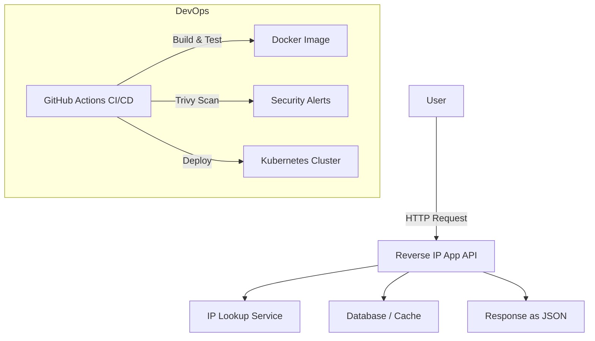

---

# 🛰️ Reverse IP App

A full-stack web application that allows users to perform **reverse IP lookups** and retrieve domain information.
The project follows modern DevOps practices — containerized with **Docker**, secured with **Trivy scans**, and deployed via **GitHub Actions CI/CD pipeline**.

---

## 📂 Folder Structure

```
reverse-ip-app/
├── .github/
│   └── workflows/        # CI/CD pipelines (build, test, deploy, security scans)
├── manifests/            # Kubernetes deployment & service manifests
├── src/                  # Application source code (TypeScript / Node.js backend)
│   ├── controllers/      # Express controllers
│   ├── services/         # Business logic (IP lookup services, etc.)
│   ├── models/           # Types, data models
│   └── index.ts          # App entrypoint
├── Dockerfile            # Container build definition
├── package.json          # Dependencies and scripts
├── tsconfig.json         # TypeScript config
└── README.md             # Documentation
```

---

## 🛠️ Tech Stack

* **Backend**: Node.js + TypeScript + Express
* **Containerization**: Docker
* **Orchestration**: Kubernetes (manifests included)
* **Database**: (optional) PostgreSQL / In-memory lookup
* **CI/CD**: GitHub Actions (build → test → security scan → deploy)
* **Security**: Trivy vulnerability scanning (SARIF results uploaded to GitHub Security tab)

---

## ⚙️ Deployment Workflow

The deployment pipeline runs automatically on **push to `main`**:

1. **Build & Test**

   * Installs dependencies
   * Runs TypeScript checks and tests
2. **Security Scan**

   * Runs [Trivy](https://aquasecurity.github.io/trivy/) against filesystem and Docker image
   * Uploads SARIF results to GitHub Security tab
3. **Docker Build & Push**

   * Builds Docker image with updated tag
   * Pushes to GitHub Container Registry (GHCR)
4. **Kubernetes Deployment**

   * Updates manifests with new image tag
   * Applies deployment to target Kubernetes cluster

---

## 🏗️ Architecture



---

## 🚀 Running Locally

```bash
# 1. Clone repo
git clone https://github.com/Oluwaseun2003/reversed-ip-app.git
cd reversed-ip-app

# 2. Install dependencies
npm install

# 3. Run locally
npm run dev

# 4. Build Docker image
docker build -t reverse-ip-app .

# 5. Run with Docker
docker run -p 3000:3000 reverse-ip-app
```

---

## ☁️ Kubernetes Deployment

```bash
# Apply manifests
kubectl apply -f manifests/

# Check deployment
kubectl get pods -n <namespace>
kubectl get svc -n <namespace>
```

---

## 🔒 Security

* CI/CD includes **Trivy scans** for vulnerabilities in:

  * Source code dependencies
  * Container images
* Results are uploaded to GitHub’s **Security → Code Scanning Alerts** tab for visibility.

---

## 📌 Future Improvements

* Add frontend dashboard for reverse IP lookups
* Enhance caching layer with Redis
* Implement user authentication for rate-limiting API usage
* Expand CI/CD with staging → production environments

---
---
image.png

---